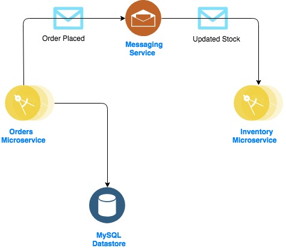

###### refarch-cloudnative-micro-orders

# Orders Microservice

*This project is part of the 'IBM Cloud Native Reference Architecture' suite, available at
https://github.com/ibm-cloud-architecture/refarch-cloudnative-kubernetes*

## Table of Contents

* [Introduction](#introduction)
* [Implementation](#implementation)
* [References](#references)

## Introduction

This project is built to demonstrate how to build Orders Microservices application. 
This application provides basic operations of saving and querying orders from a relational database as part of the Orders function of BlueCompute.

- Secured REST APIs.
- Persist order data to a MySQL database.
- Transmit stock to Inventory using Messaging service.

    

## Implementation

- [Microprofile](../../tree/microprofile/) - leverages the Microprofile framework.
- [Spring](../../tree/spring/) - leverages Spring Boot as the Java programming model of choice.

## References

- [Java MicroProfile](https://microprofile.io/)
- [Spring Boot](https://projects.spring.io/spring-boot/)
- [Kubernetes](https://kubernetes.io/)
- [Minikube](https://kubernetes.io/docs/getting-started-guides/minikube/)
- [Docker Edge](https://docs.docker.com/edge/)
- [IBM Cloud](https://www.ibm.com/cloud/)
- [IBM Cloud Private](https://www.ibm.com/cloud-computing/products/ibm-cloud-private/)
