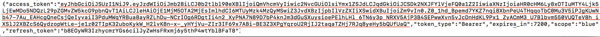

# Running Orders Service Locally

## Table of Contents

* [Building Orders using Maven](#building-orders-using-maven)
* [Setting up MySQL](#setting-up-mysql)
* [Setting up RabbitMQ](#setting-up-rabbitmq) 
* [Setting up Zipkin](#setting-up-zipkin) (Optional)
* [Running Orders and stopping it](#running-orders-and-stopping-it)
* [Deploying Orders using Helm charts](#deploying-orders-using-helm-charts)

## Building Orders using Maven

To build the application, we used Maven. Maven is a project management tool that is based on the Project Object Model (POM). 
Typically, people use Maven for project builds, dependencies, and documentation. Maven simplifies the project build. 
In this task, you use Maven to build the project.

1. Clone this repository and navigate into it.

   ```
   git clone https://github.com/ibm-cloud-architecture/refarch-cloudnative-micro-orders.git
   cd refarch-cloudnative-micro-orders/
   ```

2. Checkout the MicroProfile branch.

   ```
   git checkout microprofile
   ```
   
3. Create the [auth keystore and truststore](https://github.com/ibm-cloud-architecture/refarch-cloudnative-kubernetes/tree/microprofile/Keystore)
, and then correct their locations in your server.xml
    ```
    <ssl id="defaultSSLConfig" keyStoreRef="KeystorebcKeyStore" trustStoreRef="bcTrustStore"/>
    <keyStore id="bcKeyStore" location="<Path to BCKeyStoreFile.jks>" type="JKS" password="password"/>
    <keyStore id="bcTrustStore" location="<Path to truststore.jks>" type="JKS" password="password"/>
    ```
    
4. **Optional**: If running locally, copy [environment variables](env_vars.txt) into your `server.env` to save effort 
exporting them later. This step will be covered again before running the app.

5. Use Maven to build and install the project.

   ```
   mvn install
   ```
   
   Optionally, you may use `maven clean install` to ensure a clean working directory before you build.
   
   If this runs successfully, you will see a similar message to the one below. 
   
    ```
    [INFO] --- maven-failsafe-plugin:2.18.1:verify (verify-results) @ orders ---
    [INFO] Failsafe report directory: /Users/user@ibm.com/BlueCompute/refarch-cloudnative-micro-orders/target/test-reports/it
    [INFO] 
    [INFO] --- maven-install-plugin:2.4:install (default-install) @ orders ---
    [INFO] Installing /Users/user@ibm.com/BlueCompute/refarch-cloudnative-micro-orders/target/orders-1.0-SNAPSHOT.war to /Users/user@ibm.com/.m2/repository/projects/orders/1.0-SNAPSHOT/orders-1.0-SNAPSHOT.war
    [INFO] Installing /Users/user@ibm.com/BlueCompute/refarch-cloudnative-micro-orders/pom.xml to /Users/user@ibm.com/.m2/repository/projects/orders/1.0-SNAPSHOT/orders-1.0-SNAPSHOT.pom
    [INFO] ------------------------------------------------------------------------
    [INFO] BUILD SUCCESS
    [INFO] ------------------------------------------------------------------------
    [INFO] Total time: 45.990 s
    [INFO] Finished at: 2018-02-26T13:50:46-05:00
    [INFO] Final Memory: 21M/250M
    [INFO] ------------------------------------------------------------------------
    ```
By default, the application runs on [WebSphere Liberty with Web Profile](https://developer.ibm.com/wasdev/websphere-liberty/). You can also run it on [Open Liberty](https://openliberty.io/) as follows.

`mvn clean install -Popenliberty`

 If this runs successfully, you will be able to see the below messages.
 
 ```
[INFO] --- maven-failsafe-plugin:2.18.1:verify (verify-results) @ orders ---
[INFO] Failsafe report directory: /Users/user@ibm.com/BlueCompute/refarch-cloudnative-micro-orders/target/test-reports/it
[INFO]
[INFO] --- maven-install-plugin:2.4:install (default-install) @ orders ---
[INFO] Installing /Users/user@ibm.com/BlueCompute/refarch-cloudnative-micro-orders/target/orders-1.0-SNAPSHOT.war to /Users/user@ibm.com/.m2/repository/projects/orders/1.0-SNAPSHOT/orders-1.0-SNAPSHOT.war
[INFO] Installing /Users/user@ibm.com/BlueCompute/refarch-cloudnative-micro-orders/pom.xml to /Users/user@ibm.com/.m2/repository/projects/orders/1.0-SNAPSHOT/orders-1.0-SNAPSHOT.pom
[INFO] ------------------------------------------------------------------------
[INFO] BUILD SUCCESS
[INFO] ------------------------------------------------------------------------
[INFO] Total time: 29.996 s
[INFO] Finished at: 2018-10-25T15:06:54-05:00
[INFO] Final Memory: 29M/453M
[INFO] ------------------------------------------------------------------------
 ```

**NOTE:** We will not setup RabbitMQ as that service is used to speak with other services, such as inventory.

## Setting up MySQL

To set up MySQL, the database used in this service, in a local environment, we will need to run it in a docker container. 
You need [Docker](https://www.docker.com/) as a prerequisite.

1. To run MySQL on docker locally, run the below commands:

    ```
    cd mysql
    ```

2. Build the docker image.

    ```
    docker build -t mysql .
    ```

3. Run the container.

    ```
    docker run -p 9039:3306 -d -e MYSQL_ROOT_PASSWORD=password mysql
    ```


4. It creates the `orders` table and loads the sample data.

    ```
    cd ..
    ```

## Setting up RabbitMQ

RabbitMQ is an open source messaging client used in our application to communicate between MicroServices. That said,
you only need to setup RabbitMQ if deploying multiple services locally, such as Inventory and Orders.

RabbitMQ will also need to run in a docker container. Fortunately, we can simply pull the image from Dockerhub.

1. Pull the image:

    ```
    docker pull rabbitmq
    ```
    
2. Run the container.

    ```
    docker run -p 5672:5672 -d rabbitmq
    ```


## Setting up Zipkin 

This is an optional step.

In our sample application, we used Zipkin as our distributed tracing system.

If you want to access the traces for orders service, run Zipkin as a docker container locally. 
You can find the instructions and more details 
[here](https://github.com/ibm-cloud-architecture/refarch-cloudnative-kubernetes/blob/microprofile/Zipkin/README.md).


## Running Orders and stopping it

A few steps must be done before Orders can operate with full features which are described in steps 1 and 2.


1. Set some environment variables.

    **NOTE:** [Here](env_vars.txt) contains the file for simpler copy paste. You can also paste these into your 
    `server.env` belonging to the server. Otherwise, you can copy it into `src/main/liberty/config` but this requires a
    rebuild.

    Set the JDBC URL and few other environment variables before you start your application. The host and port depends 
    on the service you use. You can run the MySQL server locally on your system using the MySQL docker container or use 
    the [MySQL Compose](https://www.ibm.com/cloud/compose/mysql) available in [IBM Cloud](https://www.ibm.com/cloud/).
    
    ```
    export jdbcURL=jdbc:mysql://<Your host>:<Port>/ordersdb?useSSL=false
    export dbuser=<DB_USER_NAME>
    export dbpassword=<PASSWORD>
    ```
    
    If you've been following along, your JDBC environment variables should be:
        
    ```
    export jdbcURL=jdbc:mysql://localhost:9039/ordersdb?useSSL=false
    export dbuser=root
    export dbpassword=password
    ```
    
    We must set variables to notify the app RabbitMQ is running locally.
    ```
    export rabbit=localhost
    ```
    
    We must set the Zipkin host and port to defaults to suppress some missing config messages.
    
    ```
    export zipkinHost=localhost
    export zipkinPort=9411
    ``` 
    
    If hitting the secure REST endpoints, such as `orders/rest/orders`, we must set some JWKS vars.
    ```
    export jwksUri=https://localhost:9443/oidc/endpoint/OP/jwk
    export jwksIssuer=https://localhost:9443/oidc/endpoint/OP
    export administratorRealm=https://localhost:9443/oidc/endpoint/OP
    ```
    
    And lastly here are optional exports if Auth or Inventory are running.
    ```
    export auth_health=https://localhost:9443/health
    export inventory_url=http://localhost:9081/inventory/rest/inventory/stock
    export inventory_health=http://localhost:9081/health
    ```
    
2. To enable authentication, the [Auth MicroService](https://github.com/ibm-cloud-architecture/refarch-cloudnative-auth/tree/microprofile) 
must be running and the keystore must be set up. Please refer to the link for further instructions.

1. Start your server.

    ```
    mvn liberty:start-server -DtestServerHttpPort=9083 -DtestServerHttpsPort=9446
    ```

    You will see something similar to the below messages.

    ```
    [INFO] Starting server defaultServer.
    [INFO] Server defaultServer started with process ID 14781.
    [INFO] Waiting up to 30 seconds for server confirmation:  CWWKF0011I to be found in /Users/user@ibm.com/BlueCompute/refarch-cloudnative-micro-orders/orders/target/liberty/wlp/usr/servers/defaultServer/logs/messages.log
    [INFO] CWWKM2010I: Searching for CWWKF0011I in /Users/user@ibm.com/BlueCompute/refarch-cloudnative-micro-orders/orders/target/liberty/wlp/usr/servers/defaultServer/logs/messages.log. This search will timeout after 30 seconds.
    [INFO] CWWKM2015I: Match number: 1 is [18/7/18 14:42:32:751 CDT] 0000001a com.ibm.ws.kernel.feature.internal.FeatureManager            A CWWKF0011I: The server defaultServer is ready to run a smarter planet..
    [INFO] ------------------------------------------------------------------------
    [INFO] BUILD SUCCESS
    [INFO] ------------------------------------------------------------------------
    [INFO] Total time: 9.889 s
    [INFO] Finished at: 2018-07-18T14:42:32-05:00
    [INFO] Final Memory: 14M/309M
    [INFO] ------------------------------------------------------------------------
    ```
    
    From here, you may access the Orders' endpoints, like `/health` or `/openapi/ui`. 
    To hit secure REST endpoints, like `/orders/rest/orders` to retrieve our list of orders, we need to 
    authenticate our calls appropriately. Please refer [here](https://github.com/ibm-cloud-architecture/refarch-cloudnative-auth/blob/microprofile/building-locally.md) 
    for further details.

2. Retrieve the JWT from the Auth Service to authorize secure REST calls:
    ```
    curl -k -d 'grant_type=password&client_id=bluecomputeweb&client_secret=bluecomputewebs3cret&username=user&password=password&scope=openid' https://localhost:9443/oidc/endpoint/OP/token
    ```
    You should see something similar to this:
    
    
3. Create an order with a POST command so we can retrieve it later.
    ```
    curl -k -X POST \
      --url https://localhost:9446/orders/rest/orders \
      --header "Content-Type: application/json" \
      --header "Authorization: Bearer <Insert Token Here>" \
      -d '{"itemId":13401, "count":1}' 
    ```
    
2. Validate the orders service. Insert your given JWT and you should get a list of items.
    ```
    curl -k --request GET \
      --url https://localhost:9446/orders/rest/orders \
      --header 'Authorization: Bearer <Insert Token Here>'
      --header 'Content-Type: application/json'
    ```

3. If you are done accessing the application, you can stop your server using the following command.

    ```
    mvn liberty:stop-server
    ```
    
    Once you do this, you see a similar below messages.

    ```
    [INFO] CWWKM2001I: Invoke command is [/Users/user@ibm.com/BlueCompute/refarch-cloudnative-micro-orders/orders/target/liberty/wlp/bin/server, stop, defaultServer].
    [INFO] objc[14896]: Class JavaLaunchHelper is implemented in both /Library/Java/JavaVirtualMachines/jdk1.8.0_151.jdk/Contents/Home/jre/bin/java (0x101bdd4c0) and /Library/Java/JavaVirtualMachines/jdk1.8.0_151.jdk/Contents/Home/jre/lib/libinstrument.dylib (0x101c9b4e0). One of the two will be used. Which one is undefined.
    [INFO] Stopping server defaultServer.
    [INFO] Server defaultServer stopped.
    [INFO] ------------------------------------------------------------------------
    [INFO] BUILD SUCCESS
    [INFO] ------------------------------------------------------------------------
    [INFO] Total time: 3.146 s
    [INFO] Finished at: 2018-07-18T15:59:32-05:00
    [INFO] Final Memory: 13M/245M
    [INFO] ------------------------------------------------------------------------
    ```

## Deploying Orders using Helm Charts

The most convenient solution to start the Orders service uses [Kubernetes](https://kubernetes.io/), as a container orchestration tool, and [Helm](https://helm.sh/), to deploy the necessary containers with the correct configuration. 

The Orders service has a required dependency, MariaDB, which first must be obtained with:

```
helm dependency update chart/orders
```

Then run the Orders service standalone with:

```
helm install chart/orders
```
